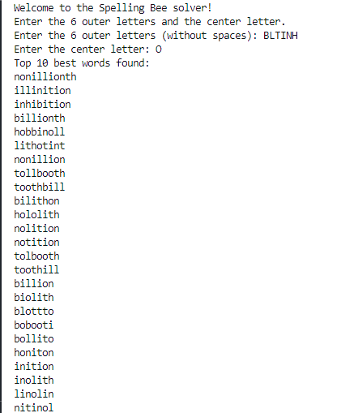

# SWEN-746 Homework 7

## Table of contents

- [SWEN-746 Homework 7](#swen-746-homework-7)
  - [Table of contents](#table-of-contents)
  - [Project Information](#project-information)
  - [Class Diagram](#class-diagram)
  - [Startup](#startup)
  - [Example Output](#example-output)

## Project Information

For this assignment the two design patterns of "Singleton" and "Strategy" will be used for a  New York Times Spelling Bee Solver.  
This system is built in Python and will use a standard english dictionary sourced from this github project: <https://github.com/dwyl/english-words?tab=readme-ov-file>. The "Singleton" design pattern in this system represents the singular game instance that each solver will solve and the "strategy" design pattern represents the fundamental algorithmic principles needed to solve the NYT Spelling bee.

*__Disclaimer:__* This project uses an different english dictionary than the one used in the official New York Times Spelling Bee game and because of such the provided answers from this system may be incorrect.

## Class Diagram

## Startup

To start up this project simply run the python "main.py" file in an IDE / virtual environment of your choice.

## Example Output

