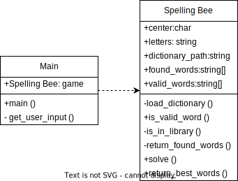
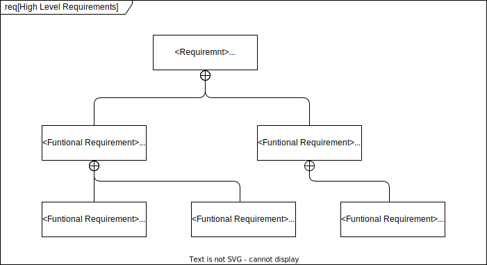

# SWEN-746 Homework 7

## Table of contents

- [SWEN-746 Homework 7](#swen-746-homework-7)
  - [Table of contents](#table-of-contents)
  - [Project Information](#project-information)
  - [Class Diagram](#class-diagram)
  - [Requirements Diagram](#requirements-diagram)
  - [Startup](#startup)
  - [Example Output](#example-output)

## Project Information

For this assignment the two design patterns of "Singleton" and "Strategy" will be used for a  New York Times Spelling Bee Solver.  
This system is built in Python and will use a standard english dictionary sourced from this github project: <https://github.com/dwyl/english-words?tab=readme-ov-file>. The "Singleton" design pattern in this system represents the singular game instance that each solver will solve and the "strategy" design pattern represents the fundamental algorithmic principles needed to solve the NYT Spelling bee.

*__Disclaimer:__* This project uses an different english dictionary than the one used in the official New York Times Spelling Bee game and because of such the provided answers from this system may be incorrect.

## Class Diagram

Through the utilization of the "Singleton" and "Strategy" design patterns the required classes to complete this system were minimal.  The single Spelling Bee game in the main class follows the singleton pattern as its the only instance of the game.  The strategy pattern can be seen in the Spelling Bee class's solve method as iterative searching along with filtering is used to return the correct answers to the game.

## Requirements Diagram

### Description

The Requirements Diagram for this system represents the high level functionality required for this system to execute the fundamental requirement of the project, Solving a Spelling Bee game.  Beyond the basic requirement of solving a Spelling Bee Game, the systems functional requirements can be summarized as taking an input and producing an output. From the input, the system needs to utilize the provided dictionary and find words in that dictionary.  Once words are found the system can move on to output functionality and check the validity of words before returning the answers to users.  

## Startup

To start up this project simply run the python "main.py" file in an IDE / virtual environment of your choice.
Once program is running add the surrounding honeycomb letters and then the center letter once prompted.

## Example Output

